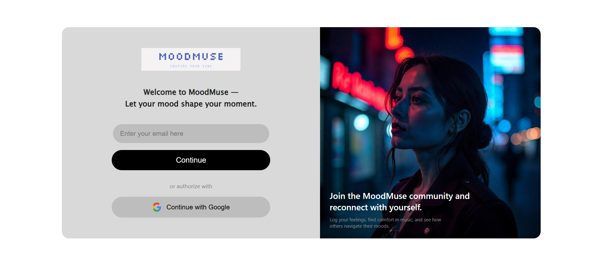

# 🎵 MoodMuse

**MoodMuse** is a web-based application that curates and recommends music based on the user's mood. Using a combination of machine learning, audio feature analysis, and user authentication, MoodMuse helps users discover the perfect tracks to match how they feel.

---

## 🌐 Live Demo

[Click here to view the live site]((https://moodmuse-gamma.vercel.app)

---

## 📸 Screenshots

### 🔐 Login Page
> 

### 🏠 Home Page
> 

### 😊 Feeling/Mood Page
> 

---

## 🚀 Features

- 🎶 Analyze audio features and classify music by mood
- 😌 Detect and suggest playlists based on emotional context
- 🔐 Google OAuth-based user authentication
- 📊 Integrate music metadata from labeled datasets
- 🧠 Uses machine learning models for mood classification

---

## 🛠️ Tech Stack

**Frontend:**
- React.js
- CSS / Tailwind / Bootstrap (your choice)

**Backend:**
- Node.js
- Express.js
- Google OAuth 2.0

**Machine Learning:**
- Python
- Pandas, NumPy
- Custom model for mood prediction

**Database:**
- MongoDB / (or whichever DB you're using)

---

## 🔐 Environment Variables

Create a `.env` file in `server/` directory with the following:

```env
GOOGLE_CLIENT_ID=your_google_client_id
GOOGLE_CLIENT_SECRET=your_google_client_secret
MONGO_URI=your_mongo_uri

```

---

## License
[MIT](LICENSE)
