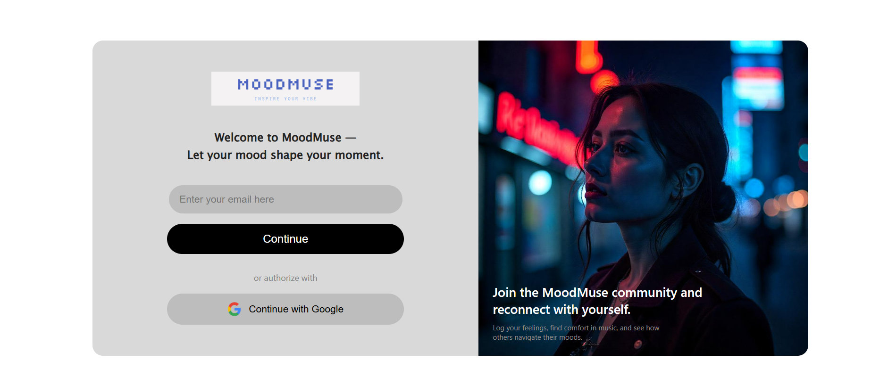
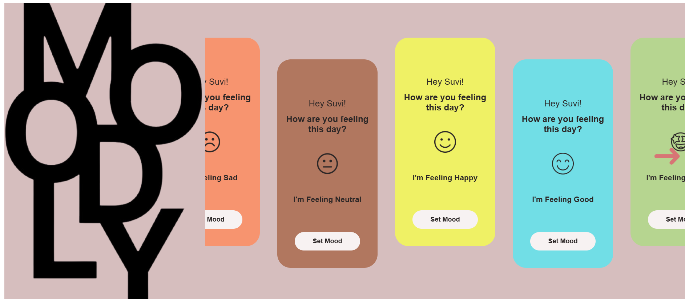

# 🎵 MoodMuse

A mood-based music recommendation and journaling application.

## Deployment

This project is deployed using GitHub Pages. The frontend is served from the `gh-pages` branch, while the backend API runs on a separate server.

### Backend Setup

1. Clone the repository:
```bash
git clone https://github.com/YOUR_USERNAME/moodmuse.git
cd moodmuse/server
```

2. Install dependencies:
```bash
npm install
```

3. Set up environment variables:
Create a `.env` file in the server directory with the following variables:
```
MONGO_URI=your_mongodb_uri
COOKIE_KEY=your_cookie_key
```

4. Start the server:
```bash
node index.js
```

### Frontend Access

The frontend is available at `https://YOUR_USERNAME.github.io/moodmuse/`

---

## 🌐 Live Demo
[Coming Soon]

---

## 📸 Screenshots

### 🔐 Login Page
> 

### 🏠 Home Page
> 

### 😊 Feeling/Mood Page
> 

---

## 🚀 Features

- 🎶 Analyze audio features and classify music by mood
- 😌 Detect and suggest playlists based on emotional context
- 🔐 Google OAuth-based user authentication
- 📊 Integrate music metadata from labeled datasets
- 🧠 Uses machine learning models for mood classification

---

## 🛠️ Tech Stack

**Frontend:**
- React.js
- CSS / Tailwind / Bootstrap (your choice)

**Backend:**
- Node.js
- Express.js
- Google OAuth 2.0

**Machine Learning:**
- Python
- Pandas, NumPy
- Custom model for mood prediction

**Database:**
- MongoDB / (or whichever DB you're using)

---

## 🔐 Environment Variables

Create a `.env` file in `server/` directory with the following:

```env
GOOGLE_CLIENT_ID=your_google_client_id
GOOGLE_CLIENT_SECRET=your_google_client_secret
MONGO_URI=your_mongo_uri

```

---

## License
[MIT](LICENSE)
